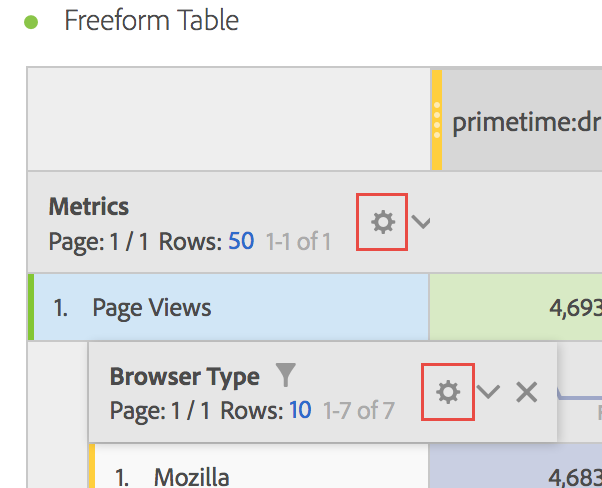

# Row settings

>[!NOTE] You are viewing the documentation for Analysis Workspace in Customer Journey Analytics. Its feature set differs slightly from [Analysis Workspace in traditional Adobe Analytics](https://docs.adobe.com/content/help/en/analytics/analyze/analysis-workspace/home.html). [Learn more...](/help/getting-started/cja-aa.md)

Row settings vary depending on which component you have dragged into the table.

You can also use [right-click actions in a table](/help/analysis-workspace/visualizations/freeform-table.md) to manage selected row(s).

To access table row settings, click the Settings icon next to a dimension, segment, metric, time period, or a breakdown within each of these:

| Row Setting | Description |
|--- |--- |
|Date Comparisons|Align dates from each column to all start on the same row.   When you choose to align the dates, for example in a month-over-month comparison between October and September 2016, the left column will start with October 1 and the right column will start with September 1. Disabled by default.|
|Percentages|Calculate percentages by row  Forces the Freeform table to calculate the cell percentages across the row as opposed to down the column. This is especially useful for trending percentages. Enabled by default when using the Visualize icon.|
|Column Totals|These settings show up only with [static rows](/help/analysis-workspace/build-workspace-project/column-row-settings/manual-vs-dynamic-rows.md) (when you have selected a finite set of items), not with dynamic rows (i.e., when you drop in a dimension that shows all items).<ul><li>**[!UICONTROL Show sum of current rows as the total]** - this shows a client-side sum of the rows in the table which means the total will **not** de-duplicate metrics like visits or visitors.</li><li>**[!UICONTROL Show Grand Total]** - this shows a server-side sum, which means the total will de-duplicate metrics like visits or visitors.</li></ul>|
|Breakdowns|**[!UICONTROL Breakdown by position]**: You can perform breakdowns based on a fixed location in a Freeform table. For example, you can specify that the top seven rows should always be broken down. (Previously, the list of values in the breakdown were "locked". This led to a situation where, for example, if you broke down  Date by  Page, you got a list of the top 50 pages for your selected date range. If you saved that report and then ran it a month later, the top 50 pages would likely have changed. However, Analysis Workspace would use the results from the original breakdown and return the same pages, but with the current month as the date range.) To perform breakdowns based on a fixed location: 1. Break down some of the rows in your table. 2. Click the Settings (gear) icon next to the table row you want in a fixed position. 3. Check the checkbox next to  Breakdown by position. 4. Change the sort order or the date range and notice that the breakdowns are now tied to the row position, not the hard-coded rows. Disabled by default.|