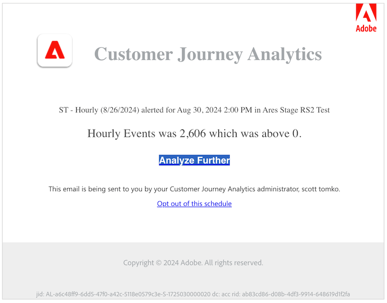

# Manage alerts

{{release-limited-testing}}

You can manage existing alerts in the Alerts manager. You can perform various management tasks on alerts, such as tagging, renaming, deleting, and more.

The Alerts manager is structured very much like the [Filter manager](/help/components/filters/manage-filters.md) and the [Calculated Metric Manager](/help/components/calc-metrics/cm-workflow/cm-manager.md).

## Create alerts

To create alerts from the Alerts manager:

1. Select **[!UICONTROL Components]** > **[!UICONTROL Alerts]** to access the Alerts manager in Customer Journey Analytics.

   

1. Select [!UICONTROL **Add**] (or [!UICONTROL **Create new alert**] if you don't have any existing alerts).

1. Continue with [Create alerts](/help/analysis-workspace/c-intelligent-alerts/alert-builder.md) for more details about creating alerts.

## Manage existing alerts 

To manage existing alerts in the Alerts manager:

1. Select **[!UICONTROL Components]** > **[!UICONTROL Alerts]** to access the Alerts manager in Customer Journey Analytics.

   

1. Select one or more alerts that you want to manage.

   

1. In the action bar, select any of the following options:

   | Action | Function | 
   |---------|----------|
   | [!UICONTROL **Tag**] | Apply a tag to an alert. This helps you to organize alerts for ease of use. | 
   | [!UICONTROL **Delete**] | Deletes the alert. | 
   | [!UICONTROL **Rename**] | Renames the alert. |
   | [!UICONTROL **Approve**] | Mark the alert as Approved. |
   | [!UICONTROL **Copy**] | Creates a copy (duplicate) of the alert. |
   | [!UICONTROL **Disable**] | Disables an alert that is currently enabled. |
   | [!UICONTROL **Enable**] | Enables an alert that is currently disabled. |
   | [!UICONTROL **Renew**] | Renews the alert expiration date. This extends the  expiration date to be 1 year from the day you selected this option, regardless of the original expiration date. |
   | [!UICONTROL **Export to CSV**] | Exports the alert to a .CSV file. |

## Edit an alert

To edit an existing alert:

1. Select **[!UICONTROL Components]** > **[!UICONTROL Alerts]** to access the Alerts manager in Adobe Analytics.

   

1. Select the alert name in the [!UICONTROL **Title and description**] column.

1. Edit the alert as desired. 

   Following are some of the things you can do when editing an alert:

   * Add alerts to other report suites
   * Change the owner 
   * Update the filters
   * Update the expiration date

1. Edit the alert, then select [!UICONTROL **Save**].

## Configure columns 

You can configure the information displayed for each alert in the Alerts manager by configuring the columns that are displayed.

To configure the visible columns in the Alerts manager:

1. In Adobe Analytics, select the **[!UICONTROL Components]** tab, then select **[!UICONTROL Alerts]**. 

1. In the Alert manager, select the **Customize columns** icon , then select the columns that you want to be displayed in the Alerts manager.

   The following columns are available:

   | Column title  | Description |
   |---|---|
   | Title and description | These values are provided in the Alert builder. To edit the title and description, select the title link to open the Alert builder.  |
   | Favorites  | Displays star icons next to each alert, allowing you to mark alerts as favorites. <!-- For more information, see [Mark calculated metrics as favorites](/help/components/c-calcmetrics/c-workflow/cm-workflow/cm-favorite.md). --> |
   | Type | Shows whether the alert is an Analytics data alert or a Server call usage alert. |
   | Enabled | Shows whether the alert is currently enabled or disabled. | 
   | Report suite | Indicates in which report suite the alert was last saved.  |
   | Owner | Indicates who owns the alert. As a non-admin, you can see only alerts you own or those that were shared with you.  |
   | Tags | Shows tags that were applied to the alert, either by you or by people who shared the alert with you.  |
   | Expiration date | Shows the date and time when the alert is set to expire. |
   | Date modified | Indicates the date when the alert was last modified.  |

   {style="table-layout:auto"}
   
   <!-- When "Last used" column is added, add this information as the description: Shows the date when the alert was last used. 
This information can help you determine whether a component is valuable to users in your organization, where it is used, and if it needs to be deleted or modified.

Consider the following when viewing this column:
<ul><li>This information does not include usage from the API, Report Builder, or Data Warehouse.</li><li>For some components, this column might not contain data if the component was last used prior to September 2023.</li></ul> -->

## Troubleshoot an alert

When troubleshooting an issue with an alert, provide the JID (Job Instance ID) number to Adobe Support. The JID number is located at the bottom of the alert email notification you received.

