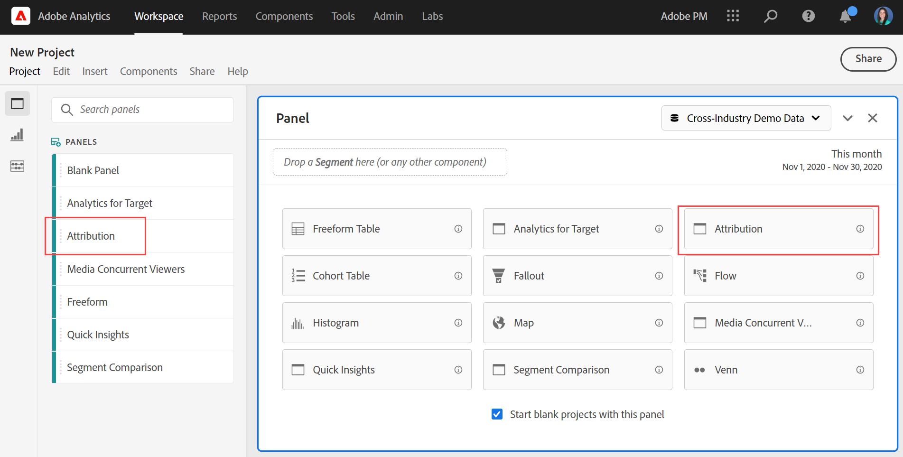

# Attribution panel {#attribution-panel}

>[!CONTEXTUALHELP]
>id="cja_workspace_attribution"
>title="Attribution"
>abstract="Quickly compare and visualize any number of attribution models using any dimension and conversion metric"
>additional-url="https://www.youtube.com/watch?v=Yu0hy2klzA0" text="Attribution IQ panel"

The [!UICONTROL Attribution] panel is an easy way to build an analysis comparing various attribution models. It is a feature that gives you a dedicated workspace to use and compare attribution models.

Customer Journey Analytics enhances attribution by letting you:

* Define attribution beyond paid media: Any dimension, metric, channel or event can be applied to models (e.g. internal search), not just marketing campaigns.
* Utilize unlimited attribution model comparison: dynamically compare as many models as you want.
* Avoid implementation changes: With report-time processing and context-aware sessions, customer journey context can be built in and applied at run time.
* Construct the session that best matches your attribution scenario.
* Break down attribution by filters: Easily compare the performance of your marketing channels across any important filter (e.g. New vs. Repeat customers, Product X vs. Product Y, Loyalty level or CLV).
* Inspect channel cross-over and multi-touch analysis: Use Venn Diagrams and Histograms, and trend attribution results.
* Analyze key marketing sequences visually: explore paths that led to conversion visually with multi-node flow and fallout visualizations.
* Build calculated metrics: use any number of attribution allocation methods.

## Create an attribution panel

1. Click the panel icon on the left.
1. Drag the [!UICONTROL Attribution] panel into your Analysis Workspace Project.

   

1. Add a metric that you want to attribute and add any dimension to attribute against. Examples include Marketing Channels or custom dimensions, such as internal promotions.

   

1. Select the attribution models and lookback window that you want to compare.

1. The Attribution panel returns a rich set of data and visualizations that compare attribution for the selected dimension and metric.

   

## Attribution visualizations

* **Total metric**: The total number of conversions that occurred over the reporting time window. These are the conversions that are attributed across the dimension you selected.
* **Attribution Comparison Bar**: Visually compares the attributed conversions across each of the dimension items from your selected dimension. Each bar color represents a distinct attribution model.
* **Attribution Comparison Table**: Shows the same data as the bar chart, represented as a table. Selecting different columns or rows in this table filters the bar chart as well as several of the other visualizations in the panel. This table acts similar to any other Freeform Table in Workspace - allowing you to add components such as metrics, filters, or breakdowns.
* **Overlap Diagram**: A Venn Diagram showing the top three dimension items and how often they participate jointly in a conversion. For example, the size of the bubble overlap indicates how often conversions occurred when a person was exposed to both dimension items. Selecting other rows in the adjacent Freeform table updates the visualization to reflect your selection.
* **Performance Detail**: Lets you to compare up to three attribution models visually using a scatter plot.
* **Trended Performance**: Shows the trend of attributed conversions for the top dimension item. Selecting other rows in the adjacent Freeform table updates the visualization to reflect your selection.
* **Flow**: Lets you see which channels are interacted with most commonly, and in what order across a person's journey.
