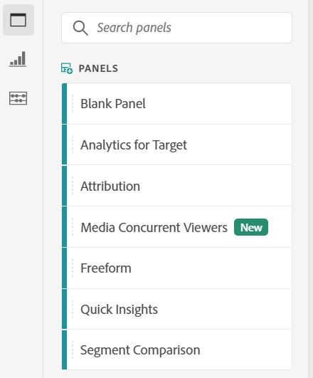

# Panels overview

A [!UICONTROL panel] is a collection of tables and visualizations. You can access panels from the top left icon in Workspace or a [blank panel](/help/analysis-workspace/c-panels/blank-panel.md). Panels are helpful when you want to organize your projects according to time periods, data views, or analysis use case. 

## Panel types

The following panel types are available in Analysis Workspace for [!UICONTROL Customer Journey Analytics]:

| Panel name | Description |
| --- | --- |
| [Blank panel](/help/analysis-workspace/c-panels/blank-panel.md) | Choose from available panels and visualizations to start your analysis. |
| [Quick Insights panel](quickinsight.md) | Quickly build a freeform table and an accompanying visualization in order to analyze and uncover insights faster. |
| [Attribution panel](attribution.md) | Quickly compare and visualize any number of attribution models using any dimension and conversion metric. |
| [Freeform panel](freeform-panel.md) | Perform unlimited comparisons and breakdowns, then add visualizations to tell a rich data story. |

[!UICONTROL Quick Insights], [!UICONTROL Blank] and [!UICONTROL Freeform] panels are great places to start your analysis, while [!UICONTROL Attribution IQ] lends itself to more advanced analyses. A `"+"` button is available in projects so you can add blank panels at any time.

The default starting panel is the [!UICONTROL Freeform] panel, but you can make the [blank panel](/help/analysis-workspace/c-panels/blank-panel.md) your default as well.

## Calendar {#calendar}

The panel calendar controls the reporting range for tables and visualizations within a panel. 

Note: If a (purple) date range component is used within a table, visualization or panel dropzone, it will override the panel calendar.

You can apply a minute-level date range under the advanced settings of your panel calendar. If you are reporting on a date range that spans many days, start time applies to the first day and end time applies to the last day in your range.

## Dropzone {#dropzone}

The panel dropzone enables you to apply filters and drop-down filters to all tables and visualizations within a panel. You can apply one or many filters to a panel. The title above each filter can be modified by clicking the edit pencil, or you can right-click to remove it altogether.

### Filters

Drag and drop any Filters from the left rail into the panel drop zone to begin filtering your panel.

### Ad-hoc filters

Non-filter components can also be dragged directly into the dropzone to create ad-hoc filters, saving you the time and effort of going to the Filter Builder. Filters created in this way are automatically defined as hit-level filters. This definition can be modified by clicking the information icon (i) next to the filter, then the pencil-shaped edit icon and editing it in the Filter Builder. 

Ad-hoc filters are local to the project and will not show up in your left rail unless you make them public.

### Drop-down filters {#dropdown-filter}

In addition to filters, drop-down filters enable you to interact with the data in a controlled way. For example, you can add a drop-down filter for Mobile Device Types so that you can filter the panel by Tablet, Mobile Phone or Desktop. 

Drop-down filters can be used to consolidate many projects into one as well. For example, if you have many versions of the same project with different Country filters applied, you can consolidate all versions into a single project and add a Country drop-down filter.

To create drop-down filters:

1. To create a drop-down filter using [!UICONTROL Dimension items], such as values within the [!UICONTROL Marketing Channel] dimension, click the right-arrow icon next to your dimension in the left rail. This will expose all of the available items. Select one or many component items from the left rail and drop them into the panel dropzone **while holding the Shift key**. This will turn the components into a drop-down filter, rather than into a single filter. 
1. To create a drop-down filter using other component such as metrics, filters, or date ranges, select from one component type in the left rail and drop into the panel dropzone **while holding down the Shift key**. 
1. Select one of the options from the dropdown to change the data in the panel. You can also choose to not filter any of the panel data by selecting **[!UICONTROL No filter]**. 

[Watch the video](https://experienceleague.adobe.com/docs/analytics-learn/tutorials/analysis-workspace/using-panels/using-panels-to-organize-your-analysis-workspace-projects.html) to learn more about how to add drop-down filters to your project.

## Right-click menu {#right-click}

Additional functionality for a panel is available by right-clicking on the panel header. 

The following settings are available:

| Setting | Description |
| --- | --- |
| [!UICONTROL Insert Copied Panel/Visualization] | Lets you paste ("insert") a copied panel or visualization to another place within the project, or into a completely different project.|
| [!UICONTROL Copy Panel] | Lets you right-click and copy a panel, so that you can insert it to another place within the project, or into a completely different project.|
| [!UICONTROL Duplicate Panel] | Makes an exact duplicate of the current panel, which you can then modify. |
| [!UICONTROL Collapse/Expand all Panels] | Collapses and expands all project panels. |
| [!UICONTROL Collapse/Expand all Visualizations in Panel] | Collapses and expands all visualizations in the current panel. |
| [!UICONTROL Edit Description] | Add (or edit) a text description for the panel. |
| [!UICONTROL Get Panel Link] | Lets you direct someone to a specific panel within a project. When the link is clicked, the recipient will be required to login before being directed to the exact panel linked to. |
