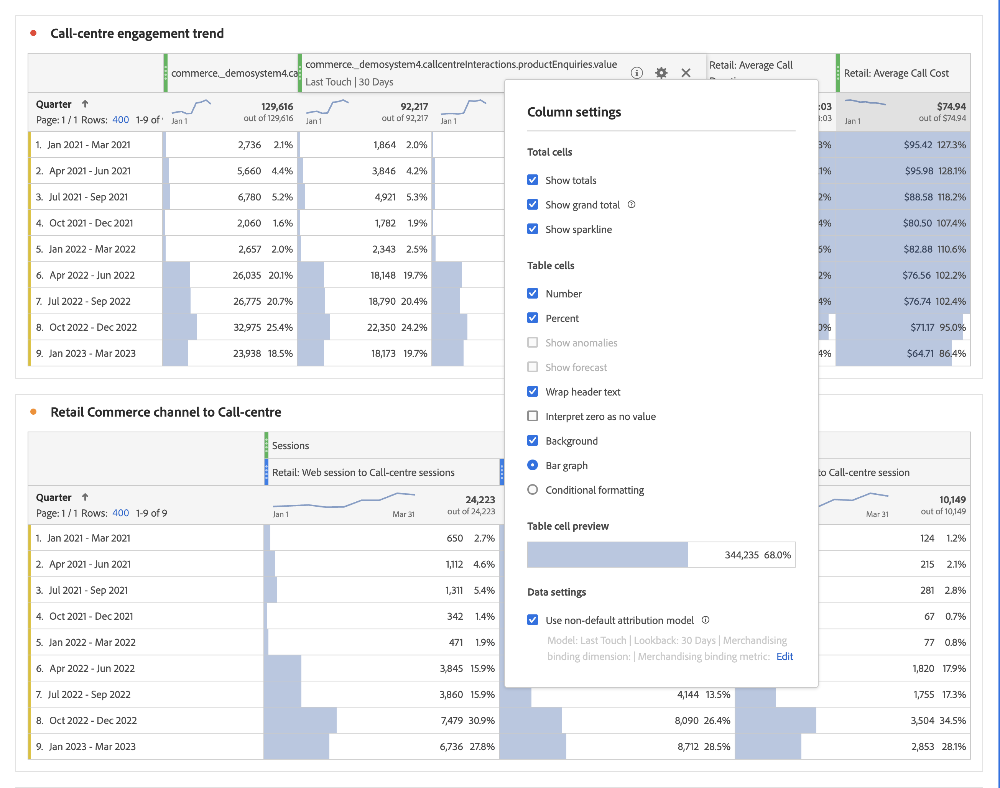

# [!UICONTROL Column Settings]

[!UICONTROL Column Settings] let you configure column formatting, some of which can be conditional.

View a video on row and column settings here:

[!VIDEO](https://video.tv.adobe.com/v/40382/?quality=12)

## Edit [!UICONTROL Column Settings] {#edit-column-settings}

To access [!UICONTROL Column Settings], drag a Freeform Table to the project, then click the gear icon in the column heading.

You can edit settings **for multiple columns at once**. Just select multiple columns and click the settings icon of any one of those columns. Any changes that you make apply to all columns with cells selected in them.

| Element | Description |
| --- | --- |
| Number | Determines if a cell shows/hides the numeric value for the metric. For example, if the metric is Page Views, the numeric value is the number of page views for the row item. |
| Percent | Determines if a cell shows/hides the percent value for the metric. For example, if the metric is Page Views, the percent value is the number of page views for the row item divided by the total page views for the column.  Note:  We can show percentages greater than 100%, to be more accurate. We are also moving the upper bound cap to 1,000% to ensure columns can grow in widths too large. |
| Anomalies | Determines if anomaly detection is run on the values in this column. |
| Wrap Header Text | Lets you wrap the header text in Freeform tables to make headers more readable and tables more shareable. This is useful for .pdf rendering and for metrics with long names. Enabled by default. |
| Interpret zero as no value | For cells with a 0 value, determines whether to show a 0 or a blank cell. This is useful when you look at data for each day of a month, and some days haven't happened yet.  Instead of showing 0's for future dates, blank cells can be shown instead. Charts respect this setting as well (i.e., they do not showing a line or bar with 0 values when this setting is checked). |
| Background | Determines if a cell shows/hides all cell formatting, including the bar graph and conditional formatting. |
| Bar Graph | Shows a horizontal bar graph representing the cell's value relative to the total for the column. |
| Conditional Formatting | See the section below. |
| Table Cell Preview | Shows a preview of how each cell appears with the currently selected formatting options applied. |

## Conditional formatting {#conditional-formatting}

Conditional formatting applies formatting to upper, midpoint, and lower limits that you can define. Applying conditional formatting (colors, etc) within Freeform tables is also automatically enabled on breakdowns, unless "Custom" limits are selected.

| Element | Description |
| --- | --- |
| Conditional Formatting | Applies the following colors to cells, based on data values: <ul><li>Green: high values</li><li>Yellow: midpoint values</li><li>Red: low values</li></ul>   Replacing a dimension in the table resets the conditional formatting limits. Replacing a metric recalculates the limits for that column (where a metric is on the X axis and a dimension is on the Y axis). |
| Use Percent Limits | Change the limit range to be based on percentages rather than absolute values. This works for metrics that are solely percentage based (like Bounce Rate) as well as for metrics that have a count and a percentage (like Page Views.) |
| Auto-generated | Automatically calculate upper/mid/lower limits based on the data. The upper limit is the largest value in this column. The lower limit is the lowest, and the midpoint is the average of the upper and lower limits. |
| Custom | Manually assign upper/mid/lower limits. This gives you the flexibility to determine when a column value becomes good, average, or poor. |

## Use non-default attribution model {#attribution}

Analysis Workspace supports [attribution](/help/analysis-workspace/attribution/overview.md) for almost any metric. 

1. Click the Settings (gear) icon in a Freeform Table column.

   

1. Under **[!UICONTROL Data Settings]**, check **[!UICONTROL Use non-default attribution model]**. For more information on different attribution models, see [Attribution models](/help/analysis-workspace/attribution/models.md).

   

>[!MORELIKETHIS]
>
>* [Manage data sources](/help/analysis-workspace/visualizations/t-sync-visualization.md)
