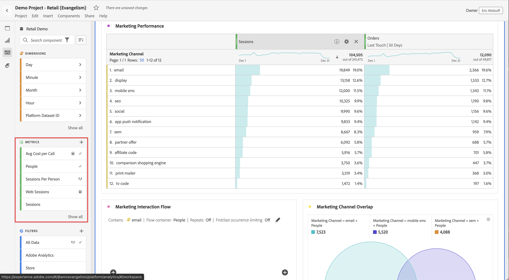

# Metrics

There are two ways to use metrics in Analysis Workspace.

You can either drag a: 

- standard metric, 
- calculated metric , or 
- calculated metric template  

(optionally approved ) from the [!UICONTROL Components] menu to the table:

>[!NOTE]
>
>While the drag and drop of metrics is seemingly simple, this use of metrics is rather powerful. You can add metrics to a report by dragging the appropriate metric to the metrics section of a table. You can also break down dimensions by metrics, giving you fine-grained control over the table view. Furthermore, you can insert a metric as a dimension and a dimension as a metric to create an overtime report. Play around with the various components and see what you can do. The possibilities are endless.

Or you can select **[!UICONTROL Components]** > **[!UICONTROL Calculated metrics]**. This takes you to the [Calculated metric builder](/help/components/calc-metrics/calc-metr-overview.md), where you can build custom metrics from existing metrics.

To make it easier to quickly create calculated metrics, **[!UICONTROL Create metric from selection]** has been added to the column right-click menu in Freeform Tables. This option displays when one or more header column cells are selected.

[Calculated Metrics: Implementation-less metrics](https://experienceleague.adobe.com/docs/analytics-learn/tutorials/components/calculated-metrics/calculated-metrics-implementationless-metrics.html) (3:42)

## Compare metrics with different attribution models

If you'd like to quickly and easily compare one attribution model to another, right-click a metric and select **[!UICONTROL Compare Attribution Models]**:

This shortcut lets you quickly and easily compare one attribution model to another without dragging in a metric and configuring it twice.

At any time, when in Analysis Workspace, and you want to get more details on a metric, hover over the metric, and select .
