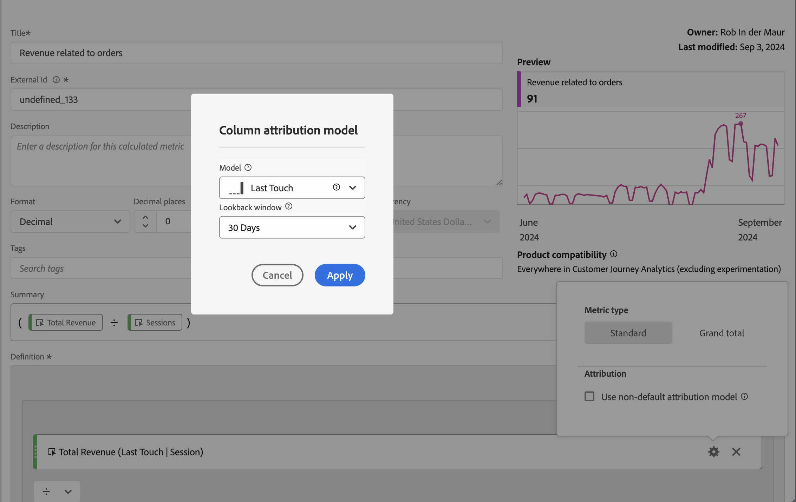

# Metric type and Attribution

You can configure the metric type and attribution model for a metric in a calculated metric definition.

1. Select  in the metric component.
1. In the popup dialog:

   

   * Specify the **[!UICONTROL Metric type]**:

      |  Metric Type  | Definition  |
      |---|---|
      |  **[!UICONTROL Standard]**  | If a formula consists of a single standard metric, it displays identical data to its non-calculated-metric counterpart. Standard metrics are useful to create calculated metrics specific to each individual line item. 
For example,  **[!UICONTROL Orders]**   **[!UICONTROL Sessions]** takes the orders for that specific line item and divides it by the number of sessions for that specific line item.  |
      |  **[!UICONTROL Grand total]**  | Use  **[!UICONTROL Grand total]** for the reporting period in every line item. If a formula consists of a single Grand total metric, the calculated metric displays the same Grand total number on every line item. Grand total metrics are useful when you want to create calculated metrics that compare against total data. 
For example,  **[!UICONTROL Orders]**   **[!UICONTROL Total Sessions]** shows the proportion of orders against all sessions, not just the sessions to the specific line item. In this example, you specify **[!UICONTROL Grand Total]** for the  **[!UICONTROL Sessions]** metric in your calculated metric, which will automatically turn it into  **[!UICONTROL Total Sessions]**. |

   * Specify **[!UICONTROL Attribution]**. 

     1. You can either:

        * Disable **[!UICONTROL Use non-default attribution model]** to use the default column attribution model, which is Last Touch, with a lookback window of 30 days.
        * Enable **[!UICONTROL Use non-default attribution model]**. In the **[!UICONTROL Column attribution model]** dialog, 
       
          * Select a **[!UICONTROL Model]** from the attribution models.
          * Select a **[!UICONTROL Lookback window]**. If you select **[!UICONTROL Custom Time]**, you can define the time period in **[!UICONTROL Minute(s)]** up to **[!UICONTROL Quarter(s)]**.

     1. Select Apply to apply the non-default attribution model. Select Cancel to cancel.

     If you already have defined a non-default attribution model, select **[!UICONTROL Edit]** to modify the selection.

## Attribution

For information about attribution in Customer Journey Analytics, see [Attribution component settings](/help/data-views/component-settings/attribution.md).
