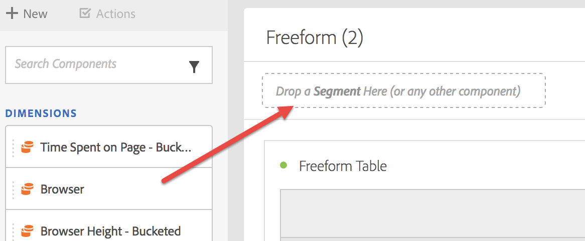
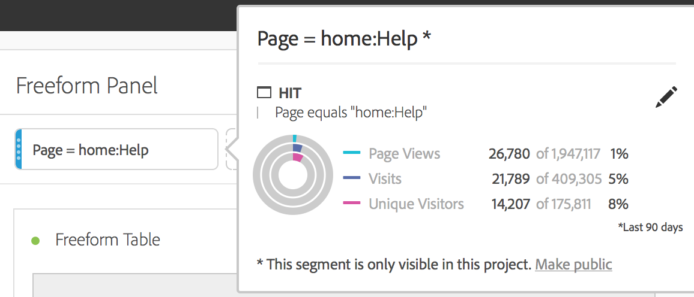

# Create filters

The Filter Builder provides a canvas to drag and drop metrics, dimensions, filters, and events to filter visitors based on container hierarchy logic, rules, and operators. This integrated development tool lets you build and save simple or complex filters that identify visitor attributes and actions across visits and page hits.

You can create instant filters by dropping any component type (dimension, dimension item, event, metric, segment, segment template, date range) into the filter drop zone at the top of a panel.

Component types are auto-converted into filters. Alternatively, you can click the "+" sign in the **[!UICONTROL Add Filter]** drop box.

Keep in mind that:

* You **cannot** drop the following component types into the filter zone: calculated metrics and dimensions/metrics from which you cannot build filters.
* For full dimensions and events, Analysis Workspace creates "exists" hit filters. Examples: "Hit where eVar1 exists" or "hit where event1 exists".
* If "unspecified" or "none" is dropped in the filter drop zone, it is automatically converted to a "does not exist" filter so that it is treated correctly.

>[!NOTE]
>
>Filters created this way are internal to the project.

You can choose to make these filters public (global) by following these steps:

1. Hover over the filter in the drop zone and click the "i" icon.
1. In the information panel that displays, click **[!UICONTROL Make public]**.

   

## Other methods for applying filters

Several other methods exist for applying filters to a project:

| Action | Description |
|--- |--- |
|Create filter from selection|Create an inline filter. Select rows, right-click the selection, then create an inline filter. This filter applies only to the open project and is not saved as an CJA filter. 1. Select rows.  2. Right-click the selection.  3. Click *Create filter from selection*.|
|Components > New Filter|Displays the Filter Builder. See [Filter Builder](https://docs.adobe.com/content/help/en/analytics/components/segmentation/segmentation-workflow/seg-build.html) for more information about filtering.|
|Share > Share Project or Share > Curate Project Data|In [Curate and Share](https://docs.adobe.com/content/help/en/analytics/analyze/analysis-workspace/curate-share/curate.html#concept_4A9726927E7C44AFA260E2BB2721AFC6), learn how filters that you apply to the project are available in shared analysis for the recipient.|
|Use filters as dimensions|Video: Using Filters as Dimensions in Analysis Workspace|

>[!VIDEO](https://video.tv.adobe.com/v/23974)
