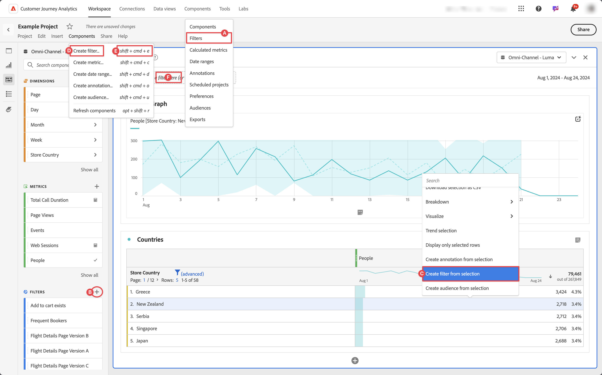

# Create filters

You can create different types of filters in Customer Journey Analytics, depending on how complex the filters need to be and whether the filters should apply to the current Workspace project only or apply to all projects. You can create filters directly in the main interface of Customer Journey Analytics or when working in a Workspace project. 

You can create a filter in the following ways:

* 🅐 In the main interface, select **[!UICONTROL Components]** and select **[!UICONTROL Filters]**. Select  [!UICONTROL **[!UICONTROL Add]**] from the [[!UICONTROL Filters] manager](/help/components/filters/manage-filters.md). 
* 🅑 In a Workspace project, from the Components left panel, select  at  **Filters**.
* 🅒 In a Workspace project, from the context menu in a visualization, select **[!UICONTROL Create filter from selection]**.
* 🅓 In a Workspace project, select **[!UICONTROL Components]** from the menu, and select **[!UICONTROL Create filter]**. 
* 🅔  a Workspace project, use the shortcut **[!UICONTROL shift+cmd+e]** (macOS) or **[!UICONTROL shift+ctrl+e]** (Windows).
* 🅕 Select  in ***Drop a filter here (or any other component)*** drop zone.

To define the new filter, you use the [Filter builder](/help/components/filters/filter-builder.md).

When working in a Workspace project, you can also create a filter quickly using [Quick filter](/help/components/filters/quick-filters.md).

<!--
Following is a summary of the filter types that are available, with links to information about how to create them:

| Filter type | Created where? | Applicable where? | When to use |
| --- | --- | --- | --- |
| Component-list filter | Click +, which takes you to the [Filter Builder](/help/components/filters/filter-builder.md) | All your Workspace projects | For more complex filters, sequential filters |
| Quick filter | [Quick filter builder](/help/components/filters/quick-filters.md) | Project only, but can save and add to your segment list. | Can be used for ad hoc single-rule filters (with drag-and-drop), or to add/edit multiple rules (by clicking the Filter icon) |  
| Filters in fallout analysis |  [Fallout visualization](/help/analysis-workspace/visualizations/fallout/compare-segments-fallout.md) in Analysis Workspace | To individual fallout visualizations | Create filters from a touchpoint, add filters as touchpoint, and compare key workflows across various filters |
| Calculated metrics-based filter | [Calculated metric builder](/help/components/calc-metrics/cm-workflow/metrics-with-segments.md) | To individual calculated metric | Apply filter/s within your metric definition |

When applying filters to a freeform project, several other methods are also available:

| Action | Description |
| --- | --- |
| Create filter from selection | Create an inline filter. This filter applies only to the open project and is not saved as a Customer Journey Analytics filter.
 1. Select which table rows you want to be part of the filter.  2. Right-click the selection.  3. Click *Create filter from selection*. |
| Workspace [!UICONTROL Components] > [!UICONTROL New Filter] | Displays the Filter Builder. See [Filter Builder](/help/components/filters/filter-builder.md) for more information about filtering. |
| Share > Share Project or Share > Curate Project Data | In [Share projects](/help/analysis-workspace/curate-share/share-projects.md) or [Curate projects](/help/analysis-workspace/curate-share/curate.md), learn how filters that you apply to the project are available in shared analysis for the recipient.|
| Use filters as dimensions | The following video demonstrates how to use filters as dimensions:  
[Use filters as dimensions in Analysis Workspace](https://experienceleague.adobe.com/docs/customer-journey-analytics-learn/tutorials/components/filters/use-filters-as-dimensions.html)
|
-->