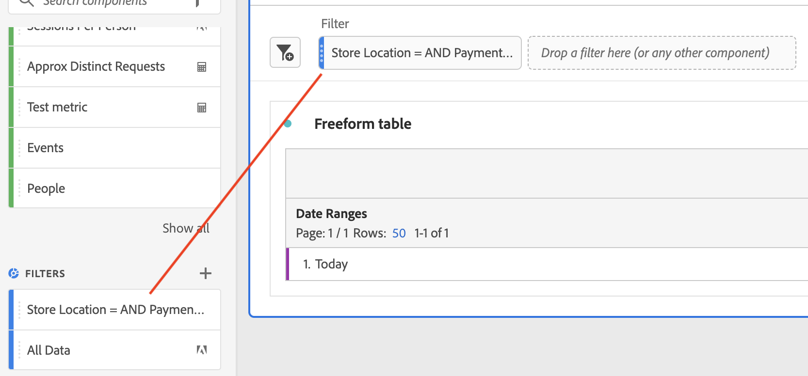
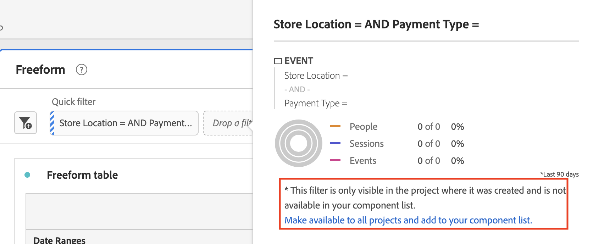
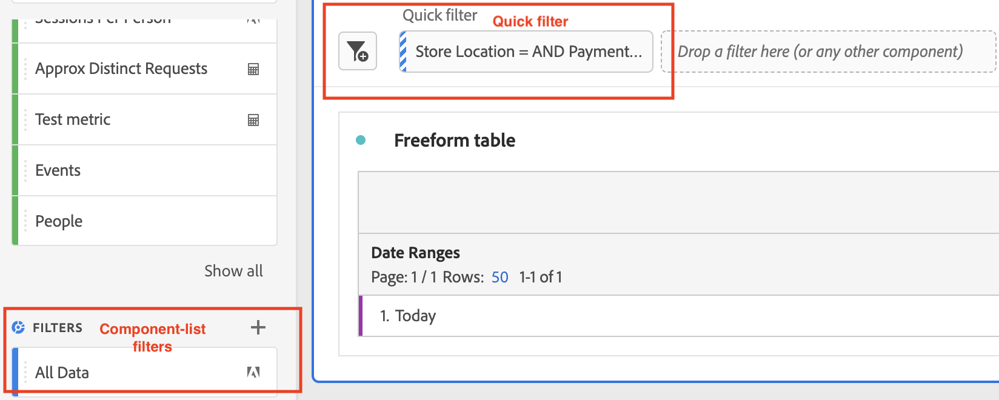

# Quick filters

Quick filters allow you to easily explore data within a given project, without the need of creating a more complex component-list filter in the [Filter Builder](/help/components/filters/create-filters.md). 

Consider the following when creating quick filters:

* Quick filters apply only to the project where they were created. They are not available in other projects and cannot be shared to other users. 
* A maximum of 3 rules are allowed.
* Nested containers or sequential rules are not supported.

The following video demonstrates how to use quick filters. (Note: this video uses the term "quick segments" instead of "quick filters." However, the functionality is the same.)

>[!VIDEO](https://video.tv.adobe.com/v/341466/?quality=12&learn=on)

## Create a quick filter {#create}

Any user in Anlysis Workspace can create a quick filter.

To create a quick filter:

1. Choose one of the following methods to begin creating the quick filter:

   * **Ad hoc (drag-and-drop):** From the left rail, drag a component to the drop zone next to the **Filter** icon in the panel header, then select the **Edit** icon to adjust the filter.

     

      >[!NOTE]
      >
      > Consider the following when creating a quick filter ad hoc (drag-and-drop):
      > * The following component types are not supported: calculated metrics and dimensions, as well as metrics from which you cannot build filters.
      > * For full dimensions and events, Analysis Workspace creates "exists" hit filters. Examples: `Hit where eVar1 exists` or `Hit where event1 exists`.
      > * If "unspecified" or "none" is dropped in the filter drop zone, it is automatically converted to a "does not exist" filter so that it is treated correctly in filtering.

   * **Using the filter icon:** In a Freeform table, select the **Filter** icon in the panel header.

     

1. Adjust any of the following settings:

   | Setting | Description |
   | --- | --- |
   | [!UICONTROL Name] | The default name of a filter is a combination of the rule names in the filter. You can rename the filter to a more friendly name. |
   | [!UICONTROL Include/exclude] | You can either include or exclude components in your filter definition, but not both. |
   | [!UICONTROL Hit/Visit/Visitor] container | Quick filters include one [filter container](https://experienceleague.adobe.com/docs/analytics-platform/using/cja-components/cja-filters/filters-overview.html#filter-containers) only that lets you include a dimension/metric/date range in (or exclude it from) the filter. [!UICONTROL Visitor] contains overarching data specific for the visitor across visits and page views. A [!UICONTROL Visit] container lets you set rules to break down the visitor's data based on visits, and a [!UICONTROL Hit] container lets you break down visitor information based on individual page views. The default container is [!UICONTROL Hit]. |
   | [!UICONTROL Components] (Dimension/metric/date range) | Define up to 3 rules by adding components (dimensions, metrics, date ranges, or dimension values). There are 3 ways to find the right component:<ul><li>Start typing and the [!UICONTROL Quick Filter] builder automatically finds the appropriate component.</li><li>Use the drop-down list to find the component.</li><li>Drag and drop components from the left rail.</li></ul>  |
   | [!UICONTROL Operator] | Use the drop-down menu to find standard operators and [!UICONTROL Distinct Count] operators. See [Filter operators](operators.md). |
   | Plus (+) sign | Add another rule |
   | AND/OR qualifiers | You can add "AND" or "OR" qualifiers to the rules, but you cannot mix "AND" and "OR" in a single filter definition. |
   | [!UICONTROL Apply] | Apply this filter to the panel. If the filter contains no data, you will be asked if you want to continue. |
   | [!UICONTROL Open builder] | Opens the Filter Builder. Once you save or apply the filter in the Filter Builder, it is no longer considered a "Quick Filter". It becomes part of the component-list filter library. 
**Note:** This option is available only to users with the Filter Creation permission in the [Adobe Admin Console](https://experienceleague.adobe.com/docs/analytics/admin/admin-console/permissions/summary-tables.html#analytics-tools).
 |
   | [!UICONTROL Cancel] | Cancel this quick filter - don't apply it. |
   | [!UICONTROL Date range] | The validator uses the panel date range for its data lookup. But any date range applied in a quick filter overrides the panel date range at the top of the panel.  |
   | Preview (top right) | Lets you see whether you have a valid filter and how broad the filter is. Represents the breakdown of the data set you can expect to see when you apply this filter. You might get a notice that indicates that this filter has no data. In this case, you can proceed or change the filter definition. |

1. Select [!UICONTROL **Apply**] to save your changes.

## Edit a quick filter {#edit}

1. Hover over the quick filter that you want to edit, then select the **Edit** icon.

   

1. Edit the filter definition or the filter name.
1. Select [!UICONTROL **Apply**] to save your changes.

## Save a quick filter as a component-list filter {#save}

>[!IMPORTANT]
>
> Consider the following when saving a quick filter:
> 
> * To save a quick filter, you need the Filter Creation permission in the [Adobe Admin Console](https://experienceleague.adobe.com/docs/analytics/admin/admin-console/permissions/summary-tables.html#analytics-tools).
> 
> * After you save or apply the filter, it can no longer be edited it in the quick filter builder. Instead, you must use the regular Filter Builder.

You can choose to save quick filters as component-list filters. Advantages of component-list filters include:

* Availablility across all your Workspace projects
* Support more complex filters as well as sequential filters

You can save filters either from the Quick Filter Builder or from the [!UICONTROL Filter Builder].

### Save in the quick filter builder {#save2}

1. After you apply the quick filter, hover over it and select the info ("i") icon.
1. Select **[!UICONTROL Make available to all projects and add to your component list]**.
1. (Optional) Rename the filter.
1. Select **[!UICONTROL Save]**.

   The filter now appears in your component list in the left rail. Also, note that the filter's side bar changes from striped blue to a lighter blue, indicating that it can no longer be edited or opened in the quick filter builder.

### Save in the Filter Builder {#save3}

1. After you apply the quick filter, hover over it and select the info ("i") icon.
1. Select **[!UICONTROL Save filter]**
1. (Optional) Rename the filter, then select [!UICONTROL **Apply**].

   Go back to Workspace and note that the filter's side bar changes from striped blue to a lighter blue, indicating that it can no longer be edited or opened in the quick filter builder. And by saving it, it becomes part of the component list.

   

After you apply the filter, you can choose to add it to your filter component list and make it available to all your projects.

1. Hover over the saved filter and select the pencil icon.

1. At the top of the Filter Builder, notice this dialog:

   

1. Select the checkbox next to **[!UICONTROL Make available to all your projects and add to your component list.]**
1. Select **[!UICONTROL Save]**.
   The filter now appears in your filter component list for all your projects.
   You can also [share the filter](/help/components/filters/manage-filters.md) with other people in your organization.

## Quick filter example

The following example of a filter combines dimensions and metrics:

The filter appears at the top. Notice its blue-striped sidebar, as opposed to the blue sidebar for component-level filters in the filter library on the left.

## What are project-only filters? {#project-only}

(Delete this section)

Project-only filters are filters that only apply to the current project they were created in. They are not available in other projects and cannot be shared to other users. They are intended for quick exploration of your data without having to create and save a filter in the left rail. Project-only filters can be created in the panel drop zone either with Quick filters or [ad hoc filters](/help/components/filters/ad-hoc-filters.md). 

If you open a project-only filter in the [!UICONTROL Filter Builder], a project-only notification appears. If you do not check "Make this filter available.." and click **[!UICONTROL APPLY]**, the segment remains a project-only filter. 

>[!NOTE]
>
>If you apply a Quick filter from the Filter Builder, it can no longer be opened in the [!UICONTROL Quick Filter Builder]. 

If you check "Make this filter available.." and click **[!UICONTROL SAVE]**, the filter becomes available in the left rail component list for use in other projects. It can also be shared with other users from the Filter Manager.

