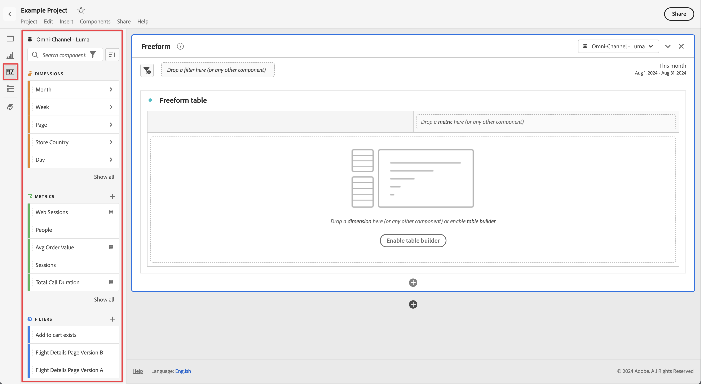

# Components overview

Components are features in Customer Journey Analytics that can be used in reports, or to complement reporting features. You can manage these components using the following steps:

1. Log in to [analytics.adobe.com](https://analytics.adobe.com) using your Adobe ID credentials.
2. Navigate to [!UICONTROL Components] > [!UICONTROL Components] in the header menu.

You can manage the following components:

* [**Filters**](filters/filters-overview.md): Exclude parts of your data to focus on common dimension items
* [**Calculated metrics**](calc-metrics/calc-metr-overview.md): Use metrics and formulas as new components for use in reporting
* [**Date ranges**](date-ranges/overview.md): Customize and refine the date ranges Analysis Workspace offers
* [**Projects**](/help/analysis-workspace/home.md): Organize and maintain your projects in Analysis Workspace

## Analysis Workspace components

Components in Analysis Workspace consist of metrics, dimensions, filters, and time granularities that you can drag-and-drop onto a project. Custom components that you create are added to these panels, such as custom date ranges.

To access the Components panel, click the **[!UICONTROL Components]** icon in the left rail. You can switch among Panels (Blank panel, [Freeform panel](/help/analysis-workspace/visualizations/freeform-table/freeform-table.md), [Quick Insights](/help/analysis-workspace/c-panels/quickinsight.md), or [Attribution IQ](/help/analysis-workspace/c-panels/attribution.md) panel), [Visualizations](/help/analysis-workspace/visualizations/freeform-analysis-visualizations.md), and Components using the left-rail icons or by using [hotkeys](/help/analysis-workspace/build-workspace-project/fa-shortcut-keys.md).

See [Create a project](/help/analysis-workspace/home.md) for information about using Components in a project.

## Component actions

You can manage components (individually or by selecting more than one) in a number of ways. Right-click a component or click **[!UICONTROL Actions]** at the top of the component list.

>[!NOTE]
>
>These actions do not apply to Time components.

| Component Action | Description |
| --- | --- |
| Tag | Organize or manage components by applying tags to them. It then shows up in the respective component manager, such as [!UICONTROL Analytics] > [!UICONTROL Components] > [!UICONTROL Filters], or [!UICONTROL Analytics] > [!UICONTROL Components] > [!UICONTROL Projects] |
| Favorite | Add the component to your list of favorites. It then shows up in the respective component manager, such as [!UICONTROL Analytics] > [!UICONTROL Components] > [!UICONTROL filters], or [!UICONTROL Analytics] > [!UICONTROL Components] > [!UICONTROL Projects]. |
| Approve | Approve the component to make it canonical. It then shows up in the respective component manager, such as [!UICONTROL Analytics] > [!UICONTROL Components] > [!UICONTROL Filters], or  [!UICONTROL Analytics] > [!UICONTROL Components] > [!UICONTROL Projects]|
| Share | Applies only to filters. |
| Delete | Applies only to filters. |

Watch the video on Creating Metrics, Filters, and Dates:

>[!VIDEO](https://video.tv.adobe.com/v/23979)

## Component access permissions

In Analysis Workspace, Admins can [curate](/help/analysis-workspace/curate-share/curate.md) which components are exposed to users in reporting.
