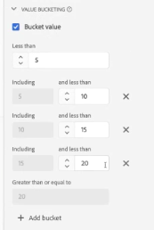
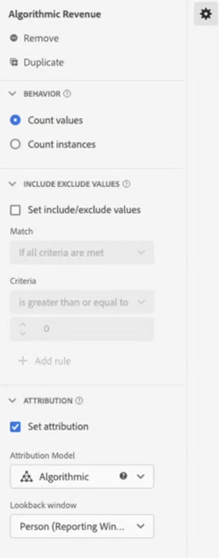

# Data views use cases

These use cases show the flexibility and power of data views in Customer Journey Analytics.

## 1. Create a metric from a string schema field {#string}

For example, when creating a data view, you could create an [!UICONTROL Orders] metric from a [!UICONTROL pageTitle] schema field that is a string. Here are the steps:

1. On the Components tab, drag the [!UICONTROL pageTitle] into the [!UICONTROL Metrics] section under [!UICONTROL Included Components].
   
1. Now highlight the metric you just dragged in and rename it under [!UICONTROL Component Settings] on the right:
   
1. Open the [!UICONTROL Include/Exclude Values] dialog on the right and specify the following:
   

   The "confirmation" phrase indicates that this is an order. After reviewing all the page titles where those criteria are met, a "1" will be counted for each instance. The result is a new metric (not a calculated metric.) A metric that has included/excluded values can be used everywhere any other metric can be used. It works with Attribution IQ, filters, and everywhere else you can use standard metrics.
1. You can further specify an attribution model for this metric, such as [!UICONTROL Last Touch], with a [!UICONTROL Lookback window] of [!UICONTROL Session].
   You can also create another [!UICONTROL Orders] metric from the same field and specify a different attribution model for it, such as [!UICONTROL First Touch], and a different [!UICONTROL Lookback window], such as [!UICONTROL 30 days].

Another example would be to use the Visitor ID, a dimension, as a metric to determine how many Visitor IDs your company has.

## 2. Use integers as dimensions {#integers}

Previously, integers would automatically be treated as metrics in CJA. Now, numerics (including custom events from Adobe Analytics) can be treated as dimensions. Here is an example:

1. Drag the [!UICONTROL call_length_min] integer into the [!UICONTROL Dimensions] section under [!UICONTROL Included Components]:

   

1. You can now add [!UICONTROL Value Bucketing] to present this dimension in a bucketed fashion in reporting. (Without bucketing, each instance of this dimension would appear as a line item in Workspace reporting.)

   

## 3. Use numeric dimensions as "metrics" in flow diagrams {#numeric}

You can use a numeric dimension to get “metrics” into your [!UICONTROL  Flow] visualization. 

1. On the Data Views [Components](https://experienceleague.adobe.com/docs/analytics-platform/using/cja-dataviews/create-dataview.html#configure-component-settings) tab, drag the [!UICONTROL Marketing Channels] schema field into the [!UICONTROL Metrics] area under [!UICONTROL Included components]. 
2. In Workspace reporting, this flow shows [!UICONTROL Marketing Channels] flowing into [!UICONTROL Orders]:

## 4. Do sub-event filtering {#sub-event}

This capability is specifically applicable to array-based fields. The include/exclude functionality lets you do filtering at the sub-event level, whereas filters (segments) built in the filter builder only give you filtering at the event level. So you can do sub-event filtering by using include/exclude in Data Views, and then reference that new metric/dimension in a filter at the event level.

For example, use the include/exclude functionality in Data Views to focus only on products that generated sales of more than 50 Dollars. So if you have an order that includes a 50 Dollar product purchase and a 25 Dollar product purchase, we would remove only the 25 Dollar product purchase, not the entire order.

1. On the Data Views [Components](https://experienceleague.adobe.com/docs/analytics-platform/using/cja-dataviews/create-dataview.html#configure-component-settings) tab, drag the [!UICONTROL Revenue] schema field into the [!UICONTROL Metrics] area under [!UICONTROL Included components].
1. Select the metric and configure the following on the right side:
   a. Under [!UICONTROL Format], select [!UICONTROL Currency].
   b. Under [!UICONTROL Currency], select USD.
   c. Under [!UICONTROL Include/Exclude Values], select the checkbox next to [!UICONTROL Set include/exclude values].
   d. Under [!UICONTROL Match], select [!UICONTROL If all criteria are met].
   e. Under [!UICONTROL Criteria], select [!UICONTROL is greater than or equal].
   f. Specify "50" as the value.

These new settings allow you to view only high-value revenue and filter out anything below $50.

## 5. Utilize the [!UICONTROL No Value Options] setting {#no-value}

Your company may have spent time training your users to expect "Unspecified" in reports. The default in Data Views is "No Value". You can now [rename "No Value" to "Unspecified"](https://experienceleague.adobe.com/docs/analytics-platform/using/cja-dataviews/create-dataview.html#configure-no-value-options-settings) in the Data Views UI.

Another example would be a dimension for a membership program registration. In this case, you could rename "No Value" to "No Membership Program Registration."

## 6. Create multiple metrics with different [!UICONTROL Attribution] settings {#attribution}

Using the [!UICONTROL Duplicate] feature at the top right, create a number of Revenue metrics with different attribution settings like [!UICONTROL First Touch], [!UICONTROL Last Touch], and [!UICONTROL Algorithmic].

Don't forget to rename each metric to reflect the differences, such as "Algorithmic Revenue":

For more information on other data views settings, see [Create data views](/help/data-views/create-dataview.md).
For a conceptual overview of data views, see [Data views overview](/help/data-views/data-views.md).

## 7. New vs. Repeat session reporting {#new-repeat}

>[!NOTE]
>
>This functionality is currently in limited testing.

You can determine whether a session is indeed the first-ever session for a user or not, based on the reporting window that you defined for this data view and a 13-month lookback window. This reporting lets you determine, for example:

* What percentage of your orders are coming from new vs. repeat sessions?

* For a given marketing channel, or a specific campaign, are you targeting first-time users or return users? How did these choices influence conversion rates?

Three components facilitate this reporting: 

* 1 dimension: [Session type](https://experienceleague.adobe.com/docs/analytics-platform/using/cja-dataviews/component-reference.html?lang=en#optional) - This dimension has two values: 1) [!UICONTROL New] and 2) [!UICONTROL Returning]. The [!UICONTROL New] line item includes all of the behavior (i.e. metrics against this dimension) from a session that has been determined to be a person's defined first session. Everything else is included in the [!UICONTROL Returning] line item (assuming everything belongs to a session). Where metrics are not part of any session, they fall into the ‘Not applicable’ bucket for this dimension.

* 2 metrics: [New sessions, Return sessions](https://experienceleague.adobe.com/docs/analytics-platform/using/cja-dataviews/component-reference.html?lang=en#optional). A new session is defined as a person’s defined first session within the reporting window. Return sessions is the number of sessions that were not a person’s first-ever session.

To access these components:

1. Go into the data view editor.
1. Click the **[!UICONTROL Components]** > **[!UICONTROL Optional Standard components]** tab in left rail.
1. Drag these components into your data view.

95%-99% of the time, new sessions are reported accurately. The only exceptions are:

* When a first session occurred before the 13-month lookback window. This session will be ignored.

* When a session spans both the lookback window and the reporting window. Let’s say you run a report from June 1 to June 15, 2022. The lookback window would encompass May 1, 2021 to May 31, 2022. If a session were to start on May 30, 2022 and end on June 1, 2022, because the session is included in the lookback window, all sessions in the reporting window get counted as return sessions. 
