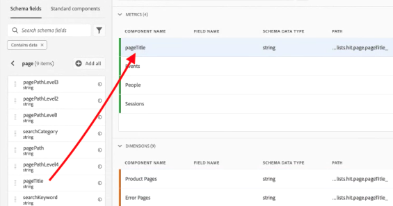
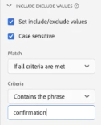

# Data views use cases

These use cases that show the flexibility and power of data views in Customer Journey Analytics.

## Create an Orders metric from a pageTitle (string) schema field

For example, when creating a data view, you could create an [!UICONTROL Orders] metric from a [!UICONTROL pageTitle] schema field that is a string. Here are the steps:

1. On the Components tab, drag the [!UICONTROL pageTitle] into the [!UICONTROL Metrics] section under [!UICONTROL Included Components].
   
1. Now highlight the metric you just dragged in and rename it under [!UICONTROL Component Settings] on the right:
   
1. Open the [!UICONTROL Include/Exclude Values] dialog on the right and specify the following:
   

   The "confirmation" phrase indicates that this is an order. After reviewing all the page titles where those criteria are met, a "1" will be counted for each instance. The result is a new metric (not a calculated metric.) It works with Attribution IQ, filters, and everywhere else you can use standard metrics.
1. You can further specify an attribution model for this metric, such as [!UICONTROL Last Touch], with a [!UICONTROL Lookback window] of [!UICONTROL Session].
   You can also create another [!UICONTROL Orders] metric from the same field and specify a different attribution model for it, such as [!UICONTROL First Touch], and a different [!UICONTROL Lookback window], such as [!UICONTROL 30 days].

## Use integers as dimensions

Previously, integers would automatically be treated as metrics in CJA. Now, numerics (including custom events from Adobe Analytics) can be treated as dimensions. Here is an example:

1. Drag the [!UICONTROL call_length_min] integer into the [!UICONTROL Dimensions] section under [!UICONTROL Included Components]:
   

1. You can now add [!UICONTROL Value Bucketing] to present this dimension in a bucketed fashion in reporting. Otherwise, each instance of this dimension would appear as a line item in Workspace.
   
