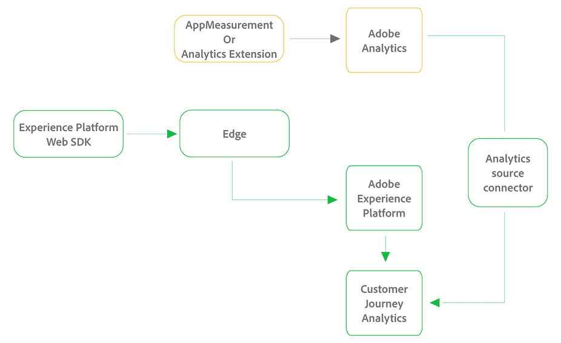

# Upgrade to Customer Journey Analytics from AppMeasurement or the Analytics Extension

Use the following sections to understand the differences between your current and future implementations, and how to get started with the upgrade.

## Understand the upgrade from an Adobe Analytics implementation to a Customer Journey Analytics implementation

The following sections show the differences between an AppMeasurement or an Analytics Extension implementation that sends data only to Adobe Analytics, and an implementation after upgrading to Customer Journey Analytics. 

### AppMeasurement or Analytics Extension implementation with Adobe Analytics only

When your Adobe Analytics environment is implemented with AppMeasurement or the Analytics Extension, data is sent directly to Adobe Analytics, as depicted in the following graphic:

### AppMeasurement or Analytics Extension implementation with both Adobe Analytics and Customer Journey Analytics

To upgrade to Customer Journey Analytics from an Adobe Analytics environment that is implemented with the AppMeasurement or the Analytics Extension, Adobe recommends a two-pronged approach: First, configure a new implementation of the Experience Platform Web SDK to begin sending data to Edge. When data is in Edge, you can send it to Adobe Experience Platform, and from Platform to Customer Journey Analytics. Second, set up the Analytics source connector to send your Adobe Analytics data to Customer Journey Analytics. 

This configuration is depicted in the following graphic, with changes from the original Adobe Analytics implementation shown in green:

## Upgrade to Customer Journey Analytics

Adobe recommends a two-pronged upgrade approach when upgrading from Adobe Analytics to Customer Journey Analytics: a new implementation of the Experience Platform WebSDK and the Adobe Analytics source connector.

When used together, this two-pronged approach lays the best foundation for a successful upgrade from Adobe Analytics to Customer Journey Analytics.

For more information about the benefits of using this approach when upgrading, see [Recommended path when upgrading from Adobe Analytics to Customer Journey Analytics](/help/getting-started/cja-upgrade/cja-upgrade-recommendations.md).

### Send data to Adobe Experience Platform

To upgrade to Customer Journey Analytics, you need to begin sending data to Adobe Experience Platform. Use the following process to send data to Platform: 

1. Create an XDM schema for your organization.

   Work with your data team to identify your organization's ideal schema design for Customer Journey Analytics.

1. Implement the Experience Platform Web SDK.

1. Send data to Platform.

For detailed information about each of these steps, see [Ingest data via the Adobe Experience Platform Web SDK](/help/data-ingestion/aepwebsdk.md).

### Set up the Analytics source connector

The Analytics source connector allows you to:

   * Bring your historical Adobe Analytics report suite data into Adobe Experience Platform and Customer Journey Analytics. 
   
     You can keep the Analytics source connector running for as long as you need to retain the historical Adobe Analytics data. 
   
   * View the data collected with your original Adobe Analytics implementation (either AppMeasurement, the Analytics Extension, or the WebSDK Extension) within Customer Journey Analytics. You can compare this data side-by-side with that of your new WebSDK implementation. 
   
     You can keep the Analytics source connector running until you are familiar and comfortable with the differences. <!--elaborate on what those differences are? -->

To set up the Adobe Analytics source connector:

1. Follow the steps in [Ingest and use data from traditional Adobe Analytics](/help/data-ingestion/analytics.md). 

