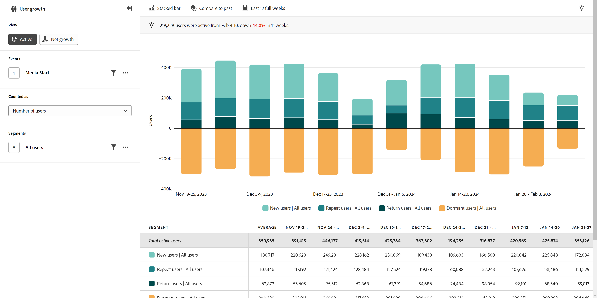

# Active view

{{release-limited-testing}}

The **Active** view provides insights around the growth and acquisition of users over a specific period. The horizontal axis is a time interval, while the vertical axis is a measurement of users. Users are split into four categories:

* **New**: The user was active during the current period, but not previously. See how far that the analysis looks back by hovering over '[!UICONTROL New users]' in the chart legend. The lookback range is dynamically determined based on the selected date range and interval.
* **Repeat**: The user was active in the current and immediately previous period.
* **Return**: The user was active in the current period and not active in the immediately previous period, but were formerly active at some point. See how far that the analysis looks back by hovering over '[!UICONTROL Return users]' in the chart legend. The lookback range is dynamically determined based on the selected date range and interval.
* **Dormant**: The user was active in the immediately previous period, but is not active in the current period. Dormant users do not count toward the total number of active users.

All active users (new + repeat + return) appear as a shade of teal above the horizontal axis, while all dormant users appear in orange below the horizontal axis.

Use cases for this view type include:

* **User retention and churn:** Provides a clear visualization around periods of high or low user retention. Recognizing these periods of high or low retention can help you make product decisions to encourage high retention or help minimize churn.
* **Campaign assessment**: Viewing a specific campaign can help you understand not only how much traffic it generated, but also how well the campaign helped users remain engaged.
* **User lifecycle analysis**: Analyzing active user growth throughout the user lifecycle can help identify specific stages where user engagement dips. For example, if there is a high ratio of dormant users for individuals in an onboarding stage, it can indicate usability issues or a need for better in-product guidance.

## Query rail

The query rail allows you to configure the following components:

* **Events**: The event that you want to measure. Since this view type is user-based, a user who interacts with the event once within the period is counted as an active user. You can include one event in a query.
* **People**: The segment that you want to measure. You can include one segment in a query.

## Chart settings

The Active view offers the following chart settings, which can be adjusted in the menu above the chart:

* **Metric**: The metric that you want to measure. Options include Number of users and Percentage of users.
* **Chart type**: The type of visualization that you want to use. Options include Stacked bar and Stacked area.

## Apply time comparison

{{apply-time-comparison}}

## Date range

The desired date range for your analysis. There are two components to this setting:

* **Interval**: The date granularity that you want to view trended data by. Valid options include Hourly, Daily, Weekly, Monthly, and Quarterly. The same date range can have different intervals which affect the number of data points in the chart and the number of columns in the table. For example, viewing an analysis spanning three days with daily granularity would show only three data points, while an analysis spanning three days with hourly granularity would show 72 data points.
* **Date**: The starting and ending date. Rolling date range presets and previously saved custom ranges are available for your convenience, or you can use the calendar selector to choose a fixed date range.
