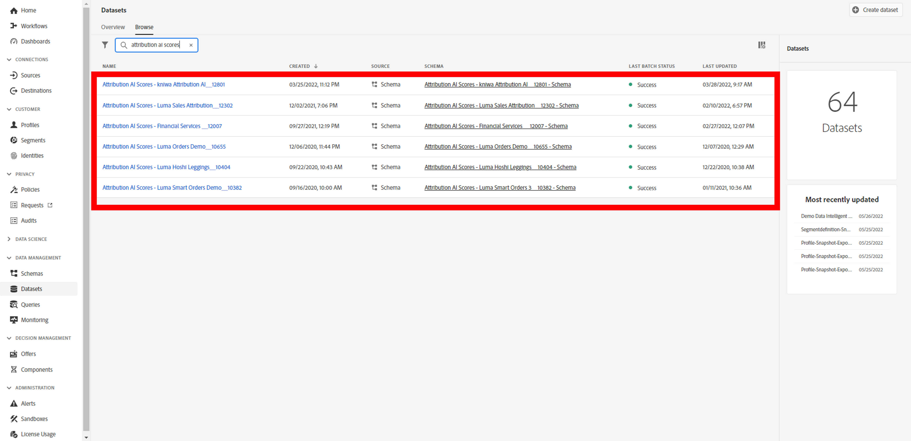
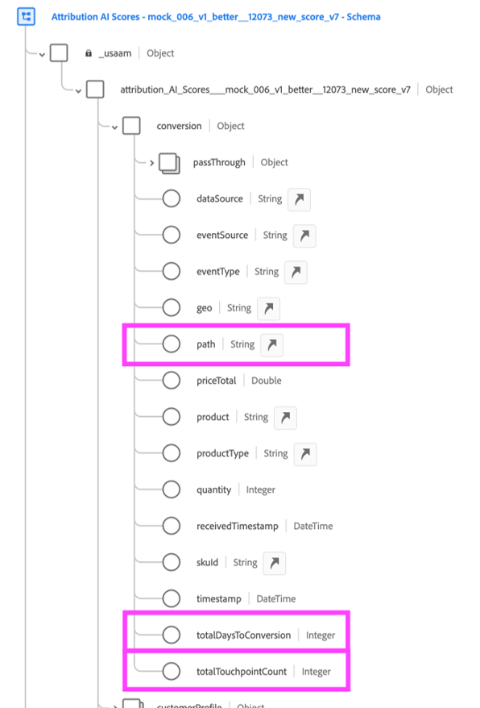

# Integrate Attribution AI with CJA

[Attribution AI](https://experienceleague.adobe.com/docs/experience-platform/intelligent-services/attribution-ai/overview.html?lang=en), as part of Adobe Experience Platform Intelligent Services, is a multi-channel, algorithmic attribution service that calculates the influence and incremental impact of customer interactions against specified outcomes. With Attribution AI, marketers can measure and optimize marketing and advertising spend by understanding the impact of every individual customer interaction across each phase of the customer journeys. 

Attribution AI integrates with Customer Journey Analytics (CJA) to the extent that Attribution AI runs models against customers' marketing touchpoints and conversion datasources. CJA then imports the output of those models as a data set, or it can be integrated with the rest of your CJA data sets. Attribution AI-enabled datasets can be then be leveraged in data views and reporting in CJA. 

Attribution AI supports 3 Experience Platform schemas: Experience Event, Adobe Analytics, and Consumer Experience Event.

Attribution AI supports two categories of scores: algorithmic and rule-based. 

## Algorithmic scores

Algorithmic scores include incremental and influenced scores. 

* **[!UICONTROL Influenced] scores** divide 100% of the conversion credit among marketing channels.
* **[!UICONTROL Incremental] scores** first take into account a conversion baseline that you would have achieved even without marketing. This baseline depends on AI observations of patterns, seasonality, and so on, due to existing brand recognition, loyalty, and word of mouth. The remaining credit is divided among marketing channels.

## Rule-based scores

Rule-based scores include 

* **[!UICONTROL First touch]** gives 100% credit to the touch point first seen in the attribution lookback window.
* **[!UICONTROL Last touch]** gives 100% credit to the touch point occurring most recently before conversion.
* **[!UICONTROL Linear]** gives equal credit to every touch point seen leading up to a conversion.
* **[!UICONTROL U-shaped]** gives 40% credit to the first interaction, 40% credit to the last interaction, and divides the remaining 20% to any touch points in between. For conversions with a single touch point, 100% credit is given. For conversions with two touch points, 50% credit is given to both.
* **[!UICONTROL Time-Decay]** follows an exponential decay with a custom half-life parameter, where the default is 7 days. The weight of each channel depends on the amount of time that passed between the touch point initiation and the eventual conversion. The formula used to determine credit is `2^(-t/halflife)`, where `t` is the amount of time between a touch point and a conversion. All touch points are then normalized to 100%.

## Workflow

Some of the steps are performed in Adobe Experience Platform prior to working with the output in CJA. The output consists of a dataset with an applied Attribution AI model.

### Step 1: Create an Attribution AI instance

In Experience Platform, create an Attribution AI instance by selecting and mapping data, defining events, and training your data, as described [here](https://experienceleague.adobe.com/docs/experience-platform/intelligent-services/attribution-ai/user-guide.html).

### Step 2: Set up a CJA connection to Attribution AI datasets

In CJA, you can now [create one or more connections](/help/connections/create-connection.md) to Experience Platform datasets that have been instrumented for Attribution AI. These datasets appear with the "Attribution AI Scores" prefix, as shown here:

### Step 3: Create data views based on these connections

In CJA, [create one or more data views](/help/data-views/create-dataview.md) that contain the Attribution AI XDM fields.

Here are the XDM schema fields for touchpoints:

And here are the XDM schema fields for conversion:

### Step 4: Report on AAI data in CJA Workspace 

In a CJA Workspace project, you can pull in metrics like "AAI Orders", and dimensions like "AAI Campaign Name" or "AAI Marketing Channel", for example. 

**Orders with influenced and incremental scores**

Here we see a Workspace project with AAI data that shows orders with influenced and incremental scores. Drill down to any dimension to understand attribution by: campaign, product group, user segment, geography, and so on.

**Marketing performance**

Compare and contrast touchpoint attribution among different attribution models:

**Channel interaction**

Understand channel interaction to see which channel can be most effectively used with other channels, using a Venn diagram:

**Top paths to conversion**

This table shows the top paths to conversion (de-duplicated) to help you design and optimize touchpoints:

**Lead time to conversion**

Here, we see the lead time to conversion when a touchpoint is in the mix. It helps with optimizing lead time:

## Differences between Attribution AI and Attribution IQ

So when should you use Attribution AI data versus [Attribution IQ](/help/analysis-workspace/attribution/overview.md), a native CJA capability? This table shows some of the differences in functionality:

| Functionality | Attribution AI | Attribution IQ |
| --- | --- | --- |
| Does incremental attribution | Yes | No |
| Allows users to adjust model | Yes | Yes |
| Does attribution across channels (Note: AAI does not use the same stitched data that CJA does.) | Yes | Yes |
| Includes influenced scores | Yes | Yes |
| Does ML modeling | Yes | Yes |
| Region-based attribution models | Yes | Yes |
| Can configure marketing touchpoints in model | Yes | No |

{style="table-layout:auto"}
