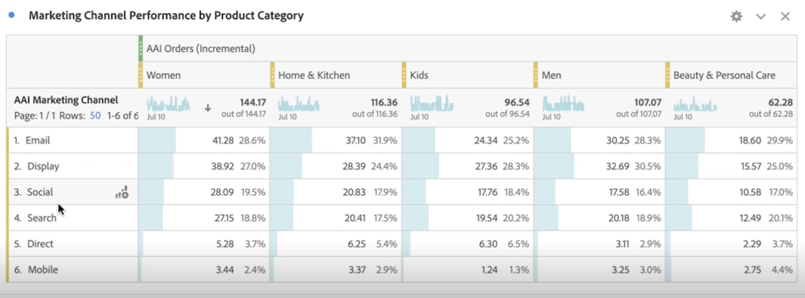

# Integrate Attribution AI with CJA

>[!NOTE]
>
>This functionality will be released on May 25, 2022.

[Attribution AI](https://experienceleague.adobe.com/docs/experience-platform/intelligent-services/attribution-ai/overview.html?lang=en), as part of Adobe Experience Platform Intelligent Services, is a multi-channel, algorithmic attribution service that calculates the influence and incremental impact of customer interactions against specified outcomes. With Attribution AI, marketers can measure and optimize marketing and advertising spend by understanding the impact of every individual customer interaction across each phase of the customer journeys. 

Attribution AI supports two categories of scores: algorithmic and rule-based. Algorithmic scores include incremental and influenced scores. 

* **Influenced scores** divide 100% of the conversion credit among marketing channels.
* **Incremental scores** first take into account a conversion baseline that you would have achieved even without marketing. This baseline depends on AI observations of patterns, seasonality, and so on, due to existing brand recognition, loyalty, and word of mouth. The remaining credit is divided among marketing channels.

Rule-based scores include [!UICONTROL First touch], [!UICONTROL Last touch], [!UICONTROL Linear], [!UICONTROL U-shaped], and [!UICONTROL Time-Decay]. Attribution AI supports 3 Experience Platform schemas: Experience Event, Adobe Analytics, and Consumer Experience Event.

Attribution AI integrates with Customer Journey Analytics (CJA) to the extent that Attribution AI runs models against data and then CJA imports the output of those models as a data set, which can then be integrated with the rest of your CJA data sets. Attribution AI-enabled datasets can be then be leveraged in data views and reporting in CJA.  

## Workflow

Some of the steps are performed in Adobe Experience Platform prior to working with the output in CJA. The output consists of a dataset with an applied Attribution AI model.

### Step 1: Create an Attribution AI instance

In Experience Platform, create an Attribution AI instance by selecting and mapping data, defining events, and training your data, as described [here](https://experienceleague.adobe.com/docs/experience-platform/intelligent-services/attribution-ai/user-guide.html).

### Step 2: Set up a CJA connection to Attribution AI datasets

In CJA, you can now [create one or more connections](/help/connections/create-connection.md) to Experience Platform datasets that have been instrumented for Attribution AI. These datasets appears with the "Attribution AI Scores" prefix, as shown here:

### Step 3: Create data views based on these connections

In CJA, [create one or more data views](/help/data-views/create-dataview.md) that contain the Attribution AI XDM fields. (Would be great to have a screenshot here.)

### Step 4: Report on AAI data in CJA Workspace 

In a CJA Workspace project, you can pull in metrics like "AAI Orders", and dimensions like "AAI Campaign Name" or "AAI Marketing Channel", for example. 

Here we see a Workspace project with AAI data that shows orders with influenced and incremental scores.

## Differences between Attribution AI and Attribution IQ

So when should you use Attribution AI data versus [Attribution IQ](/help/analysis-workspace/attribution/overview.md), a native CJA capability? This table shows some of the differences in functionality:

| Functionality | Attribution AI | Attribution IQ |
| --- | --- | --- |
| Does fractional attribution | Yes | No |
| Allows users to adjust model | Yes | Yes |
| Does attribution across channels (Note: AAI does not use the same stitched data that CJA does.) | Yes | Yes |
| Includes incremental and influenced scores | Yes | No |
| Does ML modeling | Yes | Yes |
| Does ML modeling with predictions | Yes | No |

{style="table-layout:auto"}
