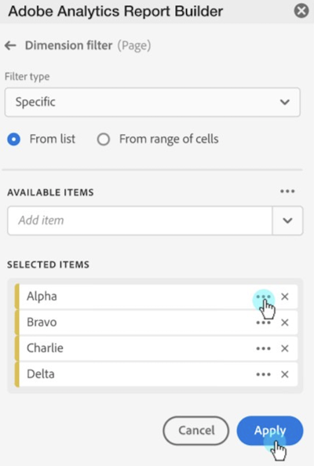

# Select a Date Range

\<\< ADD introductory statement indicating where Date Range can be changed in the user interface -- both in Create new data block and in Quick Edit panel \>\>

You can choose a date or date range for the data block using the following formats:

- Static dates
- Rolling dates using a date expression or a formula such as td
- Using dates entered in the worksheet cells

You have the option to exclude today on any selected date ranges.

1.  Use the Create new data block panel or the Quick Edit panel to select a date range.

 

1. Change the date using the following:

- The Calendar field
- The preset drop down menu
- The rolling date mode
- The customize expression mode

  

  

## Use the Calendar

When you create a new data block, you select the date range using the calendar.

1.  Select Calendar.

  NEED Image

1. Click the calendar icon to display a monthly calendar.

1. Select the date range or enter the dates in the date field.

1. Click Next.

 

 

 When you already have data blocks created, you can also reset the date range using the Date Range link in the Quick Edit menu.

1.  Click the Date Range link to display the Calendar pane.

 NEED Image

1. Click the calendar icon to display a monthly calendar or enter a date range start and end period in the format: YYYY-MM-DD~~.~~

1. Click Apply.

 

## Use Rolling Dates

The rolling dates option allows you to select a date range using rolling dates. This includes rolling dates on a daily, weekly, quarterly, or yearly basis.

When you create a new data block,

1.  Select Use rolling dates.

 NEED Image

1. Set the rolling dates using the following parameters:

- Rolling yearly
- Rolling daily
- Start
- End

1. Click Next.

 

## Use Custom Expressions

The custom expression option allows you to change the date range by building a custom expression or you can enter an arithmetic formula.

1.  Click Use rolling dates

 NEED Image

1. Click Use custom expression.

 When the Use custom Express option is selected, the standard Rolling Date Range controls are disabled.

 

1. Enter a custom expression.

 For a sample list of custom expressions, see \<\< link to expression list tables \>\>

1. Click Next.

To create a custom formula,

1. Enter a Date Reference.

1. Add Date Operators to move the date to the past or future.

 You can enter a custom date expression that includes multiple operators, such as tm-11m-1d.

### Date References

The following table lists several date reference examples.

  | Date Reference | Type         | Description                |
  | -------------- | ------------ | -------------------------- |
  | 1/1/10         | Static Date  | Entered in ISO Date format |
  | td             | Rolling Date | Start of current day    |
  | tw             | Rolling Date | Start of current week     |
  | tm             | Rolling Date | Start of current month     |
  | tq             | Rolling Date | Start of current quarter   |
  | ty             | Rolling Date | Start of current year      |

### Date Operators

The following table lists several date operator examples.

  | Date Operators | Unit     | Description                                  |
  | -------------- | -------- | -------------------------------------------- |
  | +6d            | Day      | Add 6 days to the Date Reference             |
  | +1w            | Week     | Add one full week to the Date Reference      |
  | \-2m           | Month    | Subtract 2 full months to the Date Reference |
  | \-4q           | Quart er | Subtract4 quarters to the Date Reference     |
  | \-1y           | Year     | Subtract one year to the Date Reference      |

### Date Expressions

The following tables lists several date expression examples.

  | Date Expression | Meaning                              |
  | --------------- | ------------------------------------ |
  | td-1w           | First day of last week               |
  | tm-1d           | Last day of previous month           |
  | td-52w          | Same day, 52 weeks ago               |
  | tm-11m-1d       | Last day of the same month last year |
  | "2020-09-06"    | Sept 9th, 2020                       |

## Exclude Today

Choose the **Exclude today** option to exclude today from a selected date range. Choosing to include today may pull incomplete data for today.

When selected, the Exclude Today option excludes the current day from all date range modes (calendar, rolling dates, or custom expressions).

## Valid date ranges

The following date range requirements apply:

- The start and end dates must be in the following format: YYYY-MM-DD

- The start date must be earlier to or equal to the end date. Both dates can be set to the future.

- When using rolling dates, the start date must be today or in the past. It must be in the past if Exclude today is checked.

- You can create a static date range that is set for the future. For example, you may need to set a future date for a marketing campaign launch next week. This would create a workbook monitoring for the campaign ahead of time.

- Date formats

## Use Date Range From Cell

The date range can be specified in cells in the spreadsheet. The *Date range From cell* option lets you choose the data block start and end date from selected cells. When you select the From cell option, the Calendar Panel displays From and To fields.

