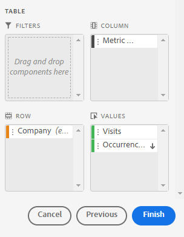

# Work with Filters in Report Builder

You can add filters when you use the Create a new data block option or when you use the Quick Edit panel. For information about adding filters when you create a new data block, see \<\<link to Create a Data Block section>\>.

After a data block is created, you can use the Quick Edit panel to modify, remove, or replace filters.

Using the Quick Edit panel, you can also substitue filters. Select one or several data blocks in the worksheet to substitute or modify filters.

When you select a range of cells in the spreadsheet, the Quick Edit panel Filter link is updated with the list of filters present in the data blocks that are included in the selection.

## Modify segments applied to selected data blocks

Click the Segment link to launch the Quick Edit - Segment Panel.

 \<\< we should get a current shot of data with both hub screen shots as shown below \>\>*

Use the Quick Edit Segment Panel to complete the following tasks:

- Add or remove a segment
- Replace a segment

## Add or Remove a Segment from a Data Block

You can add or remove segments to selected data blocks using the Quick Edit mode.

1.  Select a range of cells that intersects several data blocks.

 

1. Click Edit data block.

 The Segment Panel is displayed.

 

 

1. Search for the segments that you want to add or remove.

 You can use the Add/Remove search field to search for a specific segment or enter a search term to conduct a broader search. The list of searchable segments is all segments accessible to your user account or segments that are present in one or more data blocks.

 You can conduct the following searches:

- Search All the segments that are present in all the data blocks.
- Search for segments in one or more data blocks.

 

 In the screenshot above, \"USA\", \"Canada\" **and** \"Brazil\" segments were **all present** in **each** of the data blocks listed in the Quick edit mode.

 In the screenshot above, Mexico and Chile are present in some of the data blocks but they are not common all data blocks. Mexico and Chile maybe or may not be present in the same data block.

1. Verify the list of data blocks where the segment will be added to.

1. To remove Click the delete icon \< x > to the right of a data block name to remove the data block.

1. Click Apply to add or remove one or more segments to either list.

You can apply your changes when at least one segment is added to all the data blocks or at least one segment is removed from either list.

Click Cancel to revert and cancel out of adding or removing any selected segments.

## Replace a Segment

Use the Replace tab panel to replace one segment with another segment.

1.  Click the Replace tab.

 Need image

1. Choose one or more segments that you want to replace. If multiple   segments are selected, all segments must be present in a given data block for the replacement to occur.

 

1. Search for one or more segments that will replace the selected segments.

 

 The segment is added to the Replace with... list.

 

 In the screenshot above, \"Exclude BOT Traffic\", \"Mobile\" **and** \"North America\" segments were **all present** in **each** of the data blocks being edited.

1. Click apply.

 The list of segments is updated to reflect the substitution/replacement.

 
