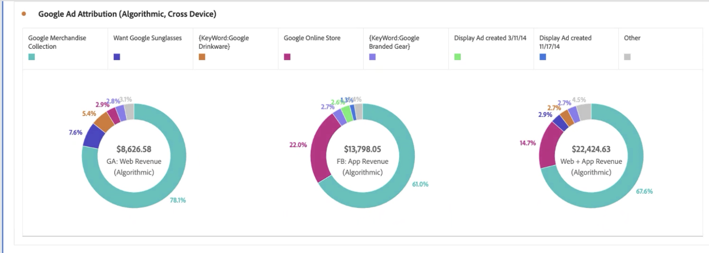

# Report on Google Analytics data in Customer Journey Analytics

Once you have data available in Customer Journey Analytics, the following examples provide useful scenarios for reporting on that data.

## Visualize web data and app data as combined datasets

This Venn diagram shows the overlap of users on your website (from your Google Analytics data) and on your mobile app (from your Firebase data) and from your call center. You can also see the top performing products - not just on the web, but also in the mobile app. You can even get the total revenue from both by using a calculated metric. Notice how the top products tell a different story when you look at the combined revenue. Without the combined datasets, you would never have known that the "Twill cap" was such a strong performer.

## Identify call reasons and reduce call volume

You can trend call center time spent over the last two months to determine call volume. The following example shows this data trended over the last two months. The following example shows an increasing trend, which can impact organizational costs.

Using the dimension 'Call reason' can hint at ways to improve the web experience, preventing visitors from calling in the first place. The above example shows that "Damage product" has an average call time of nearly 3 minutes per call, giving your organization a precise way to improve the customer experience and drive down call center costs.

You can view which products cause most of the calls to your call center and how many customers made those calls. The bubble chart shows that 20,000 people called, spent more than 4 hours 30 minutes and returned 33 units of the "Men's short Sleeve Tee" product.

Applying a dimension breakdown of 'Call reason", the example shows a "Damaged Product" dimension item. The next step would be to contact the quality control department and see why customers have been receiving damaged T-shirts.

You can look at which website pages drove calls to the call center. This report lets you know where less-optimal experiences are on the web site and help your Product Managers solve those challenges. The following example uses a calculated metric to filter the data down to only sessions that ended with a call center call. It also uses the "participation" model in CJA’s [Attribution IQ](https://experienceleague.adobe.com/docs/analytics-platform/using/cja-workspace/attribution/models.html#cja-workspace).

The following example shows that the "Shopping Cart" and "Checkout Information" pages drives most of the calls.

The cohort table allows you to see how long it typically takes for users to call the call center after having visited the website. The following example indicates that the average time for this example dataset is between three to four weeks.

## Use advanced marketing attribution

CJA allows you to use sophisticated attribution models on cross-channel data. In the following example, you can see a comparison of applying Last touch, first touch, u-shaped, and algorithmic attribution of revenue to the Google Analytics Channel Grouping dimension.

Using a calculated metric, you can apply that attribution to your web revenue, mobile app revenue, and even remove product returns. As a result, you can see true net revenue for each marketing channel.

Attribution IQ also lets you filter your data. You can see attribution against only specific sets of users, such as those who are using more than one device.

You can also attribute your Web and App revenue to your Google Ad Content. This dataset's example gained more revenue from the mobile app being driven by online Google Ads than from the web. By sorting ads by web and app revenue, you get a different picture of what your top performing Google ads were.

Combining datasets in CJA allows you to see in this example that online ads were having any impact to products purchased on your mobile app. The following visualization shows that mobile app revenue from Google Ads represents an extra $14k - $15k, compared to the web alone.

