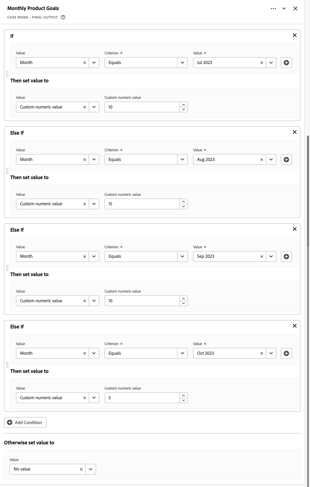

# Use derived fields to report on goals

This use case describes how to use the power of derived fields to set goals for a specific dimension and then use these goals in your Workspace project.

If you are not familiar with derived fields, refer to the [tutorial](https://experienceleague.adobe.com/docs/customer-journey-analytics-learn/tutorials/data-views/derived-fields-in-cja.html?lang=en) and [documentation](../data-views/derived-fields/derived-fields.md) for an introduction.

## Define goals

To define goals, create a new derived field where you explicitly set custom numeric values directly or indirectly using the values resulting from rules earlier in your derived field definition.

### Monthly Gift Certificate Orders Goals

You want to explicitly set goals for your gift certificate orders for 4 months, ranging from July 2023 - October 2023. To do this:

1. Create a new derived field with the name `Monthly Gift Certificate Orders Goal (Incremental)`.

1. Set static values, using a CASE WHEN RULE, for each month, by setting a **[!UICONTROL Custom numeric value]**. See the Monthly Product Goals rule below.

    

### Marketing channel revenue goals

You want to set a monthly revenue goal for each of your marketing channels. To do this:

1. Create a new derived field, using the [Marketing channels function template](/help/data-views/derived-fields/derived-fields.md#marketing-channels) with the name `Monthly Marketing Channel Revenue Goal (Incremental)`.

1. Define all rules to properly identify each of the marketing channels based on a combination of URL PARSE and CASE WHEN rules. For example:

    

1. Explicity set static values, representing monthly revenue goals, for the specific marketing channels in a final CASE WHEN rule, by setting a **[!UICONTROL Custom numeric value]**. See the [!DNL Monthly Goal] rule below.

    

## Use goals

To use goals in your Workspace project, use the calculated metric functionality to 'normalize' the derived field back to its orginal static value.

### Monthly Gift Certificate Orders Goals

1. Create a calculated metric field named `Monthly Gift Certificate Orders Goal`, defined as:

    

1. You can create additional calculated fields, for example `% of Monthly Gift Certificate Orders Goal`, to show actual revenue progresses against the goals, for example:

    

You can use these calculated metrics to report on progress in freeform tables and visualizations. For example:

### Marketing channel revenue goals

1. Create a calculated metric field named `Marketing Channel Revenue Goal`, defined as:

    

1. You can create additional calculated fields, for example `% of Marketing Channel Revenue Goal`, to show actual revenue progresses against the goals, for example:

    

You can use these calculated metrics to report on progress in freeform tables and visualizations. For example:

